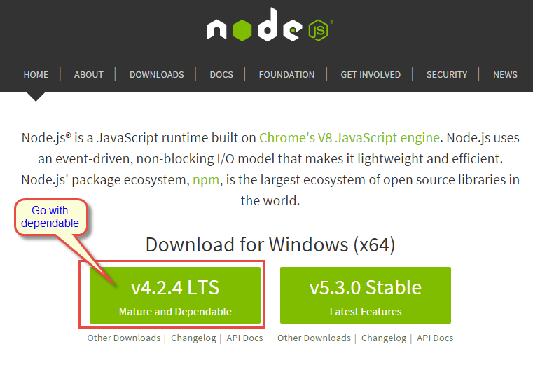
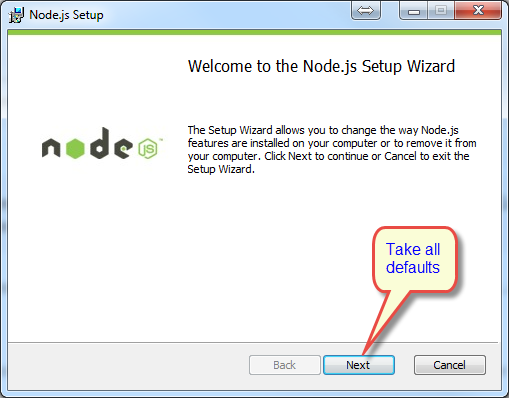
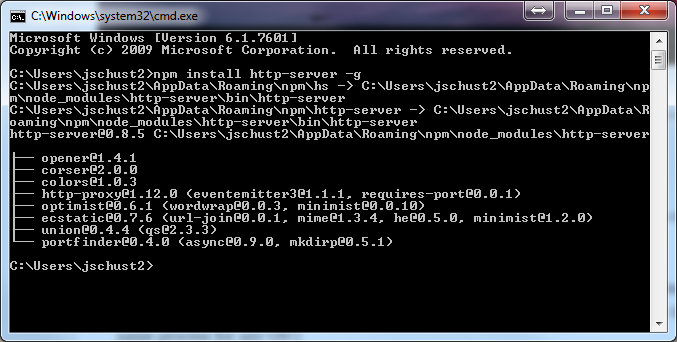
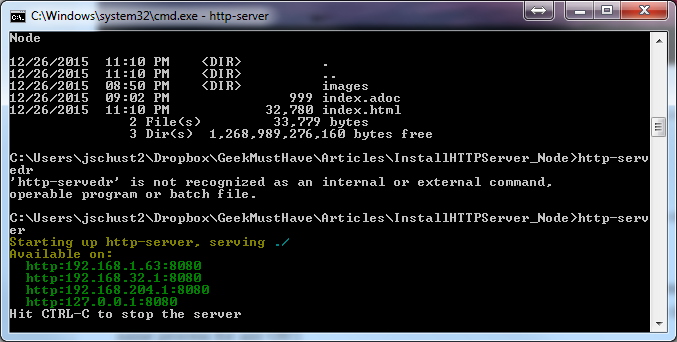
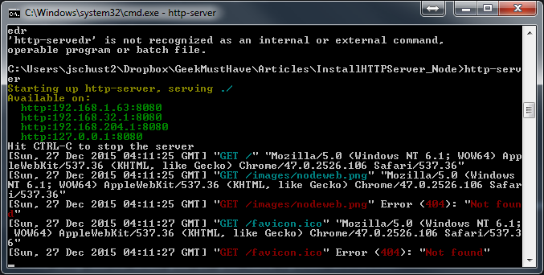
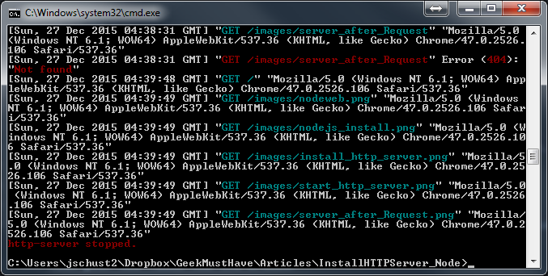

= Install basic HTTP server using NODE.js
GeekMustHave <Geek.MustHave@PhoenixWorkgroup.com>
v1.0, 04/15/2018:Article
:experimental:
:icons: font

At some point in time you are going to need a HTTP server to test your JavaScript code.
This method shows how to do this using either Python or Node.

== Python method
A typical method is to use the Python command.

.Linux Method
 $ cd /home/somedir   <--- Directory where web files are located
 $ python -m SimpleHTTPServer

.Windows Method
 C:\Users\jschust2> cd \myWebFiles     <----- Directory where web files are located
 C:\myWebFiles> python -m SimpleHTTPServer

This only works when you if you have Python installed.
Some Windows editions don't have it.
Another method is to use NODE.JS.

NOTE: I didn't want to install Python on my Windows system(s) and was planning to use NODE.JS anyway, so lets install it.

== Node.js method

I would suggest using the https://nodejs.org/en/[Node web site] to install the NODE.js.

For simplicity sake just take all of the defaults

=== Install the Node HTTP server component

Run this command, from the Windows command line,  to install the HTTP server.  It uses the NPM package installer.

 npm install http-server -g

=== Start the HTTP service

Run this command, from the Windows command line, to start the HTTP server.

 http-server

=== View your web files via the browser

Start up your favorite browser, Chrome in my case, and enter the following URL.

  http://localhost:8080

Do some work in the browser with your web pages.  Then take a look at the Window running the HTTP service.

== Stop the server

To stop the HTTP server press the kbd:[Ctrl+C] keys.

Special Thanks to http://www.jhh.me/blog/2012/12/24/setting-up-http-server-on-windows-with-node-js/[JHH Blog] for the tip.
